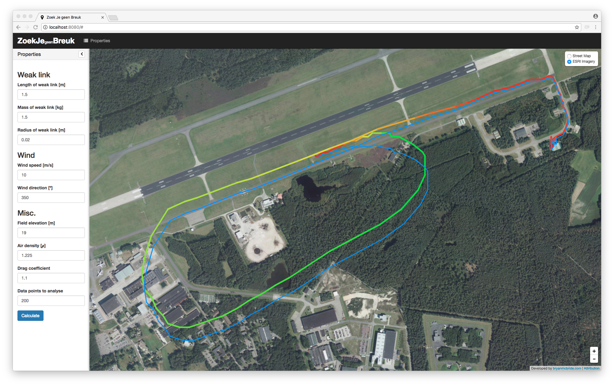

Weak Link Localization Proof of Concept
=======================================

# About
This repo contains a proof of concept showing that it is possible to localize a broken weak link by combining some basic weather information with the flight track.

By combining several forces (wind / aircraft speed) it is possible to approximate where the remains of the weak link will fall. 

In the screenshot below you can see the flight path (red to green, based on height) and the path where the weak link will fall when disconnected (blue).

## Screenshot

