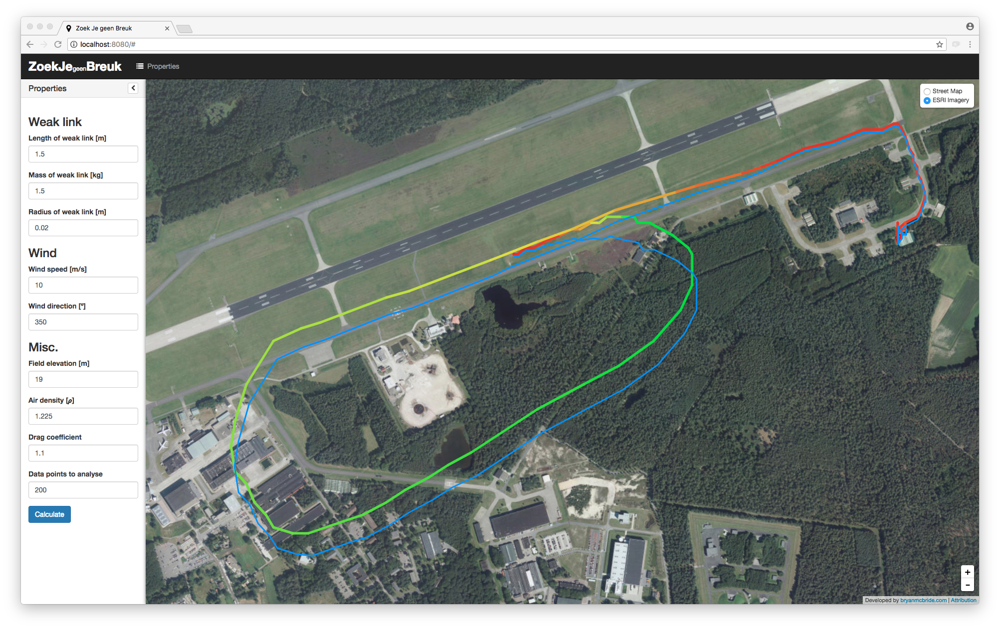

Weak Link Localization Proof of Concept
=======================================

## About
This repo contains a proof of concept showing that it is possible to localize a broken weak link by combining some basic weather information with the flight track.

By combining several forces (wind / aircraft speed) it is possible to approximate where the remains of the weak link will fall. 

In the screenshot below you can see the flight path (red to green, based on height) and the path where the weak link will fall when disconnected (blue).

[Find the interactive proof of concept here.](https://wbac.github.io/weak-link-localization-poc/index.html)

## Screenshot

## Usage
Given that this is just a proof of concept the JSON file containing the flight path is added in the data folder and it's path is hardcoded in the application. In order to run the application please restore the node dependencies first with `node install`.

## Commercial availability
This functionality is now implemented within [SkyHop](https://skyhop.org), a flight analysis platform specifically designed for glider pilots. As flights are automatically registered it is possible to get an accurate estimate of a weak link's location with the press of a button, saving hours of searching.
